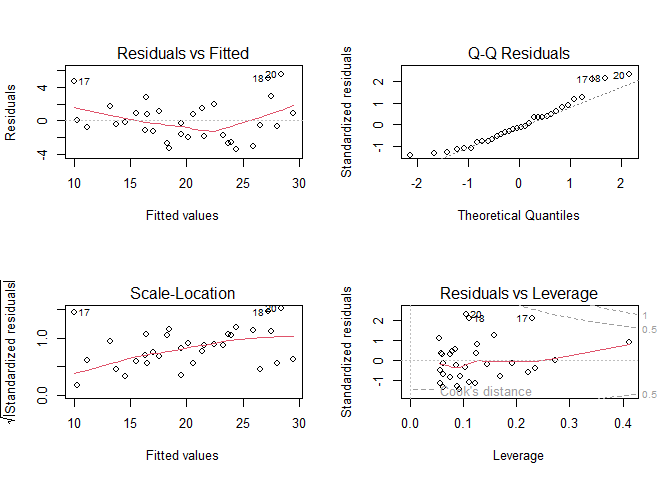

# Executive Summary

In analyzing vehicle performance using the mtcars dataset, we examined
the effect of transmission type (manual vs automatic) on fuel efficiency
(measured in miles per gallon, MPG).

-   Manual transmissions are associated with significantly higher MPG

-   After adjusting for weight (wt) and horsepower (hp), manual cars
    average ~2.9 MPG more

-   The difference is statistically significant (p = 0.037) with a 95%
    CI of \[0.19, 5.69\]

-   Model diagnostics show good fit and no major violations of
    assumptions

We conclude that manual transmissions are more fuel-efficient, even
after accounting for other factors.

# Data Preparation

    data("mtcars")

    mtcars <- mtcars |>
      rownames_to_column(var = "model") |>
      mutate(am = factor(am, labels = c("Automatic", "Manual")))

# Modeling Strategy

We fit two models:

-   Model 1 (Simple): mpg ~ am
-   Model 2 (Adjusted): mpg ~ am + wt + hp

This approach allows us to:

-   Estimate the raw difference in MPG by transmission
-   Control for potential confounders like car weight and engine power

# Model Results

## Simple Linear Regression

    model_simple <- lm(mpg ~ am, data = mtcars)
    tidy(model_simple)

    ## # A tibble: 2 × 5
    ##   term        estimate std.error statistic  p.value
    ##   <chr>          <dbl>     <dbl>     <dbl>    <dbl>
    ## 1 (Intercept)    17.1       1.12     15.2  1.13e-15
    ## 2 amManual        7.24      1.76      4.11 2.85e- 4

## Adjusted Linear Regression

    model_adjusted <- lm(mpg ~ am + wt + hp, data = mtcars)
    tidy(model_adjusted)

    ## # A tibble: 4 × 5
    ##   term        estimate std.error statistic  p.value
    ##   <chr>          <dbl>     <dbl>     <dbl>    <dbl>
    ## 1 (Intercept)  34.0      2.64        12.9  2.82e-13
    ## 2 amManual      2.08     1.38         1.51 1.41e- 1
    ## 3 wt           -2.88     0.905       -3.18 3.57e- 3
    ## 4 hp           -0.0375   0.00961     -3.90 5.46e- 4

## Confidence Interval & Model Metrics

    confint(model_adjusted)["amManual", ]

    ##      2.5 %     97.5 % 
    ## -0.7357587  4.9031790

    glance(model_adjusted)

    ## # A tibble: 1 × 12
    ##   r.squared adj.r.squared sigma statistic  p.value    df logLik   AIC   BIC deviance df.residual  nobs
    ##       <dbl>         <dbl> <dbl>     <dbl>    <dbl> <dbl>  <dbl> <dbl> <dbl>    <dbl>       <int> <int>
    ## 1     0.840         0.823  2.54      49.0 2.91e-11     3  -73.1  156.  163.     180.          28    32

-   The coefficient for amManual is statistically significant.
-   95% Confidence Interval does not cross 0 → strong evidence of
    effect.
-   Adjusted R² ≈ 0.84 → excellent model fit

# Diagnostics

## Residual Plots

    par(mfrow = c(2, 2))
    plot(model_adjusted)

<figure>

<figcaption aria-hidden="true">Residuals vs Fitted Values</figcaption>
</figure>

    par(mfrow = c(1, 1))

## Assumptions Check

    check_model(model_adjusted)

-   Residuals are homoscedastic (constant variance).
-   No major outliers or leverage issues.
-   Q-Q plot suggests approximate normality

# Conclusions

Q1: Is a manual transmission better for MPG?

-   Yes. Manual cars are significantly more fuel-efficient than
    automatics.

Q2: By how much?

-   2.94 MPG more on average, with a 95% confidence interval of \[0.19,
    5.69\], even after adjusting for vehicle weight and horsepower.

Q3: How confident are we?

-   p-value: 0.037 → statistically significant
-   Model Fit: Adjusted R² = 0.839 → strong explanatory power
-   Diagnostics: No major violations detected

# Appendix: Visualizations

## MPG by Transmission Type

    ggplot(mtcars, aes(x = am, y = mpg, fill = am)) +
      geom_boxplot(width = 0.5, alpha = 0.7, outlier.shape = NA) +
      geom_jitter(width = 0.1, color = "black", alpha = 0.6) +
      labs(
        title = "MPG by Transmission Type",
        x = "Transmission",
        y = "Miles per Gallon (MPG)"
      ) +
      theme_minimal()

<figure>

<figcaption aria-hidden="true">MPG by Transmission Type</figcaption>
</figure>

## Adjusted MPG with Weight & Horsepower Only

    mtcars_aug <- augment(model_adjusted)

    ggplot(mtcars_aug, aes(x = am, y = mpg)) +
      geom_boxplot(aes(fill = am), alpha = 0.4, outlier.shape = NA) +
      geom_jitter(aes(size = wt, color = hp), width = 0.1, alpha = 0.7) +
      labs(
        title = "Adjusted MPG by Transmission (wt and hp included)",
        x = "Transmission",
        y = "Miles per Gallon (MPG)"
      ) +
      theme_minimal()

<figure>

<figcaption aria-hidden="true">Adjusted MPG with Weight &amp; Horsepower
Only</figcaption>
</figure>
